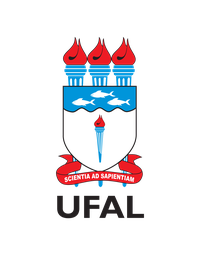

#       Programação I

>   **Autor:** [Carlos Antunis Bonfim da Silva Santos](https://github.com/carlos-antunis-physics/)
>
>   Este projeto é desenvolvido sob a [Licença MIT](./LICENSE).

Bem-vindo às minhas resoluções das listas da disciplina de Programação I! Os códigos aqui implementados foram construídos tanto para revisar a programação em linguagem C quanto para compreender mais a fundo os exemplos desenvolvidos na disciplina de Programação I do curso de Engenharia da Computação da UFAL.

>   [!NOTE]
>
>   Dado que a disciplina de **Programação I** se baseia principalmente na resolução de exercícios propostos com base nos conceitos da linguagem de programação `C` apresentados em sala, dispus aqui apenas as resoluções dos exercícios propostos, que consegui resolver, no decorrer da disciplina.

##      [Primeira avaliação](./avaliacao-I/)

A primeira avaliação abrangeu os fundamentos da linguagem `C`, tais como variáveis e identificadores, síntaxe básica de um programa em `C`, entrada e saída padrão, operadores e expressões e construtos condicionais de controle de fluxo, tais como `if`, `else`, `else if` e `switch case`. Foram dispostas duas listas de exercícios e uma [lista de revisão](./avaliacao-I/lista-revisao/) para prova com questões anteriormente aplicadas.

>   ###     [Lista I](./avaliacao-I/lista-I/)
>
>   Esta lista foi disposta com problemas elementares a serem solucionados utilizando a linguagem `C`, permitindo assim tanto treinar a síntaxe básica da linguagem, bem como aplicar os conceitos de declaração de variáveis, aplicação de operadores e expressões e utilização da entrada e saída padrão.

>   ###     [Lista II](./avaliacao-I/lista-II/)
>
>   Esta lista foi proposta com problemas que exigem condicionais ao longo da execução do programa, permitindo assim a aplicação de construtos condicionais de controle de fluxo (`if`, `else`, `else if` e `switch case`) e do operador ternário.

##      [Segunda avaliação](./avaliacao-II/)

Para a segunda avaliação foi discutido a implementação de funções na linguagem `C`, desde a sua declaração e implementação, à sua chamada, abordando também temas como funções recursivas e funções de retorno vazio (`void`). Foram também dispostas duas listas de exercícios e uma [lista de revisão](./avaliacao-II/lista-revisao/) para prova com questões anteriormente aplicadas.

>   ###     [Lista III](./avaliacao-II/lista-III/)
>
>   Nesta lista foram abordados problemas envolvendo o tema de funções na linguagem `C`, tais como declaração, implementação e chamada de funções, funções recursivas e funções de retorno vazio (funções `void`).

>   ###     [Lista IV](./avaliacao-II/lista-IV/)
>
>   Nesta lista foram abordados problemas mais elaborados envolvendo o tema de funções recursivas na linguagem `C`.

##      [Terceira avaliação](./avaliacao-III/)

Para a terceira avaliação nos ativemos ao estudo dos arranjos de dados na linguagem `C`, desde a declaração até a utilização de `arrays` e `strings` e sua passagem como parâmetros para funções. Duas listas de exercícios foram também disponibilizadas ademais a uma lista de revisão (que não fiz XD).

>   ###     [Lista V](./avaliacao-III/lista-V/)
>
>   Nesta lista foram abordados mais problemas envolvendo a implementação de funções recursivas na linguagem `C`, ademais a alguns problemas já envolvendo declaração e passagem de `arrays` como parâmetros para funções.

>   ###     [Lista VI](./avaliacao-III/lista-VI/)
>
>   Nesta lista foram abordados mais problemas envolvendo a implementação de funções recursivas na linguagem `C`, ademais a mais alguns problemas envolvendo declaração e passagem de `arrays` como parâmetros para funções.

##      [Quarta avaliação](./avaliacao-IV/)

Para a quarta avaliação estudamos mais profundamente os arranjos de dados na linguagem `C`, bem como ponteiros, arrays e matrizes e laços de repetição. Até o presente momento, duas listas de exercícios foram disponibilizadas, ademais a uma lista de revisão (que também não fiz XD).

>   ###     [Lista VII](./avaliacao-IV/lista-VII/)
>
>   Nesta lista foram abordados problemas envolvendo estrutras de repetição na linguagem `C`, ademais a mais alguns problemas envolvendo `arrays`.

>   ###     [Lista VIII](./avaliacao-IV/lista-VIII/)
>
>   Nesta lista foram abordados problemas envolvendo manipulação de arrays e matrizes na linguagem `C`.